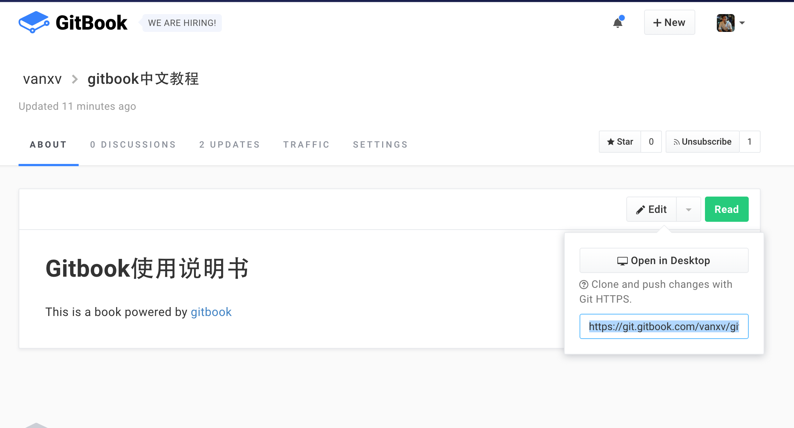

#github和gitbook
他们的框架是一样的
一个是电子书的形式呈现
一个是时光机模式

#gitbook
#新建库上传
```
touch README.md SUMMARY.md
git init
git add README.md SUMMARY.md
git commit -m "first commit"
git remote add gitbook https://git.gitbook.com/{{UserName}}/{{Book}}.git
  例：git remote add gitbook https://git.gitbook.com/vanxv/gitbook.git
git push -u -f gitbook master
```
#现有库推送
```
git remote add gitbook https://git.gitbook.com/{{UserName}}/{{Book}}.git
  例：git remote add gitbook https://git.gitbook.com/vanxv/gitbook.git
git push -u -f gitbook master
```

#下载gitbook
```
git clone https://git.gitbook.com/vanxv/gitbook.git
```
#gitbookurl获取
An image: 


#github
新建库直接丢上去就好了。
到首页新建库，然后
```
git init
git add README.md
git commit -m "first commit"
git remote add origin https://github.com/vanxv/learngitbook.git
git push -u origin master
```
#github加入已有库
```
git remote add origin https://github.com/vanxv/learngitbook.git
git push -u origin master
```
#关联gitbook和github
1.进入**gitbook**

2.在需要同步的页面上 **edit** 下面有个 **book settings**

3.左侧有个 **github** 进入后 **select a  Reposltory**

4.选择需要同步的文本.

5.点击 **sync**

当github上有新文件上传时，gitbook也会自动同步
